# 🛡️ APort Examples

<div align="center">

**Production-ready examples for The Passport for AI Agents**

[](https://aport.io)
[](https://www.python.org)
[](https://nodejs.org)
[](https://www.typescriptlang.org)

**Add runtime authorization to your AI agents in minutes, not days.**

</div>

---

## 🚀 Quick Start (30 seconds)

### Verify an Agent Passport

```bash
curl "https://api.aport.io/api/verify/ap_a2d10232c6534523812423eec8a1425c"
```

### Verify a Policy (Refund Example)

```bash
curl -X POST "https://api.aport.io/api/verify/policy/finance.payment.refund.v1" \
  -H "Content-Type: application/json" \
  -d '{
    "context": {
      "agent_id": "ap_a2d10232c6534523812423eec8a1425c",
      "policy_id": "finance.payment.refund.v1",
      "context": {
        "amount": 5000,
        "currency": "USD",
        "customer_id": "cust_123",
        "order_id": "order_456",
        "reason_code": "customer_request",
        "region": "US",
        "idempotency_key": "refund_001"
      }
    }
  }'
```

**That's it!** Policy verification automatically verifies the passport - no separate call needed.

---

## 📚 What's Inside

### 🎯 Core Examples

| Example | Language | Description | File |
|---------|----------|-------------|------|
| **Basic Usage** | JavaScript | Complete Node.js client with all API methods | [`javascript/basic-usage.js`](./javascript/basic-usage.js) |
| **Basic Usage** | Python | Full-featured Python client class | [`python/basic_usage.py`](./python/basic_usage.py) |
| **cURL Examples** | Bash | Copy-paste ready API calls | [`curl/basic-usage.sh`](./curl/basic-usage.sh) |
| **MCP Enforcement** | JavaScript | Express.js middleware for MCP validation | [`javascript/mcp-enforcement.js`](./javascript/mcp-enforcement.js) |
| **MCP Enforcement** | Python | FastAPI middleware for MCP validation | [`python/mcp_enforcement.py`](./python/mcp_enforcement.py) |

### 🤖 Framework Integrations

| Framework | Pattern | Status | Directory |
|-----------|---------|--------|-----------|
| **OpenAI Agents SDK** | Decorator | ✅ Production Ready | [`openai-agents/`](./openai-agents/) |
| **Microsoft Agent Framework** | Middleware | ✅ Production Ready | [`microsoft-agent-framework/`](./microsoft-agent-framework/) |
| **Anthropic Claude** | Decorator | 📝 Coming Soon | [`anthropic/`](./anthropic/) |
| **LangChain / LangGraph** | Decorator | 📝 Coming Soon | [`langchain/`](./langchain/) |

### 🔧 DevOps & CI/CD

| Tool | Description | File |
|------|-------------|------|
| **GitHub Actions** | Policy verification in CI/CD pipelines | [`github-actions/aport-verify.yml`](./github-actions/aport-verify.yml) |

### 📖 Tutorials

| Tutorial | Description |
|----------|-------------|
| **Getting Started** | Your first API call and policy verification | [`tutorials/getting-started.md`](./tutorials/getting-started.md) |

---

## 🎨 How It Works

```mermaid
graph LR
    A[🤖 AI Agent] -->|Decides Action| B[🛡️ APort Check]
    B -->|✅ Allowed| C[⚡ Execute Tool]
    B -->|❌ Denied| D[🚫 Block Action]
    C --> E[✅ Success]
    D --> F[❌ Error]
    
    style A fill:#8b5cf6,color:#ffffff
    style B fill:#10b981,color:#ffffff
    style C fill:#f59e0b,color:#ffffff
    style D fill:#ef4444,color:#ffffff
    style E fill:#10b981,color:#ffffff
    style F fill:#ef4444,color:#ffffff
```



**APort enforces authorization *after* the agent decides an action but *before* executing it.**

---

## 🏃‍♂️ Run Examples

### JavaScript/Node.js

```bash
# Install dependencies (if using SDK)
npm install @aporthq/sdk-node

# Run basic examples
node examples/javascript/basic-usage.js

# Run MCP enforcement example
node examples/javascript/mcp-enforcement.js
```

### Python

```bash
# Install dependencies (if using SDK)
pip install aporthq-sdk-python

# Run basic examples
python examples/python/basic_usage.py

# Run MCP enforcement example
python examples/python/mcp_enforcement.py
```

### cURL

```bash
# Make executable and run
chmod +x examples/curl/basic-usage.sh
./examples/curl/basic-usage.sh
```

---

## 🎯 Framework Integration Examples

### OpenAI Agents SDK

**Location**: [`examples/openai-agents/`](./openai-agents/)

**What it does**: Pre-action authorization using decorator pattern

**Quick example**:
```python
from openai_agents import Agent
from aport_examples.openai_agents import with_pre_action_authorization

@with_pre_action_authorization(
    policy_id="finance.payment.refund.v1",
    extract_context=lambda args, kwargs: {
        "amount": kwargs.get("amount"),
        "currency": kwargs.get("currency"),
        "customer_id": kwargs.get("customer_id"),
    }
)
def process_refund(amount, currency, customer_id):
    # Your refund logic here
    return {"refund_id": "ref_123"}
```

**See full examples**:
- [`pre_action_authorization.py`](./openai-agents/pre_action_authorization.py) - Core decorator
- [`complete-example.py`](./openai-agents/complete-example.py) - Full integration
- [`with-guardrails-openai.py`](./openai-agents/with-guardrails-openai.py) - Combined with GuardrailsOpenAI

### Microsoft Agent Framework

**Location**: [`examples/microsoft-agent-framework/`](./microsoft-agent-framework/)

**What it does**: Pre-action authorization using middleware pattern

**Quick example**:
```python
from agent_framework import Agent
from aport_examples.microsoft_agent_framework import aport_agent_middleware

agent = Agent(
    middleware=[
        aport_agent_middleware(
            policy_id="finance.payment.refund.v1",
            extract_context=lambda context: {
                "amount": context.get("amount"),
                "currency": context.get("currency"),
            }
        )
    ]
)
```

**See full examples**:
- [`aport_middleware.py`](./microsoft-agent-framework/aport_middleware.py) - Core middleware
- [`simple-example.py`](./microsoft-agent-framework/simple-example.py) - Minimal setup
- [`complete-example.py`](./microsoft-agent-framework/complete-example.py) - Full integration

---

## 🔐 MCP (Model Context Protocol) Examples

APort validates MCP servers and tools against passport allowlists.

### Single MCP Server/Tool

```javascript
const decision = await client.verifyPolicy(agentId, "finance.payment.refund.v1", {
  amount: 5000,
  currency: "USD",
  mcp_server: "https://mcp.stripe.com",
  mcp_tool: "stripe.refunds.create"
});
```

### Multiple MCP Servers/Tools (Preferred)

```javascript
const decision = await client.verifyPolicy(agentId, "finance.payment.refund.v1", {
  amount: 5000,
  currency: "USD",
  mcp_servers: ["https://mcp.stripe.com", "https://mcp.notion.com"],
  mcp_tools: ["stripe.refunds.create", "notion.pages.export"]
});
```

**Full examples**:
- [`javascript/mcp-enforcement.js`](./javascript/mcp-enforcement.js) - Express.js middleware
- [`python/mcp_enforcement.py`](./python/mcp_enforcement.py) - FastAPI middleware

---

## 📊 Example Structure

```
examples/
├── README.md                          ← You are here
├── javascript/
│   ├── basic-usage.js                ← Complete Node.js client
│   └── mcp-enforcement.js            ← MCP middleware for Express
├── python/
│   ├── basic_usage.py                ← Complete Python client
│   └── mcp_enforcement.py            ← MCP middleware for FastAPI
├── curl/
│   └── basic-usage.sh                ← Copy-paste API calls
├── openai-agents/
│   ├── README.md                     ← Full documentation
│   ├── pre_action_authorization.py  ← Core decorator
│   ├── complete-example.py           ← Full integration
│   └── with-guardrails-openai.py    ← Combined with GuardrailsOpenAI
├── microsoft-agent-framework/
│   ├── README.md                     ← Full documentation
│   ├── aport_middleware.py          ← Core middleware
│   ├── simple-example.py            ← Minimal setup
│   └── complete-example.py           ← Full integration
├── github-actions/
│   └── aport-verify.yml             ← CI/CD integration
└── tutorials/
    └── getting-started.md            ← Step-by-step guide
```

---

## 🎓 Learning Path

### 1. **Start Here** (5 minutes)
   - Read [`tutorials/getting-started.md`](./tutorials/getting-started.md)
   - Run a cURL example: [`curl/basic-usage.sh`](./curl/basic-usage.sh)

### 2. **Choose Your Language** (10 minutes)
   - **JavaScript**: [`javascript/basic-usage.js`](./javascript/basic-usage.js)
   - **Python**: [`python/basic_usage.py`](./python/basic_usage.py)

### 3. **Integrate with Your Framework** (30 minutes)
   - **OpenAI Agents SDK**: [`openai-agents/`](./openai-agents/)
   - **Microsoft Agent Framework**: [`microsoft-agent-framework/`](./microsoft-agent-framework/)

### 4. **Add MCP Support** (15 minutes)
   - **JavaScript**: [`javascript/mcp-enforcement.js`](./javascript/mcp-enforcement.js)
   - **Python**: [`python/mcp_enforcement.py`](./python/mcp_enforcement.py)

### 5. **Deploy to Production** (20 minutes)
   - **GitHub Actions**: [`github-actions/aport-verify.yml`](./github-actions/aport-verify.yml)

---

## 🔑 Key Concepts

### Pre-Action Authorization

APort enforces authorization **after** an agent decides an action but **before** executing it:


### Policy Verification Flow

```mermaid
graph TB
    A[Agent Request] --> B[Extract Context]
    B --> C[Call /api/verify/policy/{pack_id}]
    C --> D[APort Verifies Passport]
    D --> E[APort Evaluates Policy]
    E --> F{Decision}
    F -->|✅ Allow| G[Execute Action]
    F -->|❌ Deny| H[Return Error]
    
    style A fill:#8b5cf6,color:#ffffff
    style C fill:#10b981,color:#ffffff
    style D fill:#3b82f6,color:#ffffff
    style E fill:#3b82f6,color:#ffffff
    style G fill:#10b981,color:#ffffff
    style H fill:#ef4444,color:#ffffff
```

---

## 🛠️ Configuration

### Environment Variables

```bash
# API Configuration
export APORT_API_BASE_URL="https://api.aport.io"
export APORT_API_KEY="your-api-key"

# For admin operations
export ADMIN_TOKEN="your-admin-token"
```

### API Endpoints

| Endpoint | Method | Purpose |
|----------|--------|---------|
| `/api/verify/{agent_id}` | GET | Verify agent passport |
| `/api/verify/policy/{pack_id}` | POST | Verify policy (auto-verifies passport) |
| `/api/admin/create` | POST | Create new passport |
| `/api/admin/update` | POST | Update passport |

---

## 📝 Common Use Cases

### 1. Payment Refunds

```python
decision = await client.verify_policy(
    agent_id="ap_my_agent",
    policy_id="finance.payment.refund.v1",
    context={
        "amount": 5000,
        "currency": "USD",
        "customer_id": "cust_123",
        "order_id": "order_456",
        "reason_code": "customer_request",
        "region": "US",
        "idempotency_key": "refund_001"
    }
)

if decision.allow:
    # Process refund
    process_refund(amount, currency, customer_id)
else:
    # Handle denial
    raise AuthorizationError(decision.reasons)
```

### 2. Data Exports

```python
decision = await client.verify_policy(
    agent_id="ap_my_agent",
    policy_id="data.export.create.v1",
    context={
        "table_name": "users",
        "row_limit": 1000,
        "include_pii": False,
        "mcp_servers": ["https://mcp.notion.com"],
        "mcp_tools": ["notion.pages.export"]
    }
)
```

### 3. Repository Merges

```python
decision = await client.verify_policy(
    agent_id="ap_my_agent",
    policy_id="code.repository.merge.v1",
    context={
        "repo": "company/my-repo",
        "base_branch": "main",
        "files_changed": 5,
        "lines_added": 100
    }
)
```

---

## 🚨 Error Handling

All examples include robust error handling:

```python
try:
    decision = await client.verify_policy(agent_id, policy_id, context)
    if not decision.allow:
        # Policy denied
        for reason in decision.reasons:
            print(f"Denied: {reason.code} - {reason.message}")
except AportError as e:
    # API error
    print(f"API Error: {e.message}")
except Exception as e:
    # Unexpected error
    print(f"Error: {e}")
```

---

## 🤝 Contributing

Found a bug or want to add an example? We'd love your help!

1. **Fork the repo**
2. **Create your example** in the appropriate directory
3. **Add documentation** (README or inline comments)
4. **Submit a PR**

See [`CONTRIBUTING.md`](../CONTRIBUTING.md) for guidelines.

---

## 📞 Support & Resources

- **📖 Full Documentation**: [`../docs/`](../docs/)
- **🐛 Report Issues**: [GitHub Issues](https://github.com/aporthq/agent-passport/issues)
- **💬 Ask Questions**: [GitHub Discussions](https://github.com/aporthq/agent-passport/discussions)
- **🌐 Website**: [aport.io](https://aport.io)

---

## 📄 License

All examples are provided under the same license as the main project. See [`../LICENSE`](../LICENSE) for details.

---

<div align="center">

**Made with ❤️ by the APort team**

[Get Started](./tutorials/getting-started.md) • [View All Examples](#-whats-inside) • [Documentation](../docs/)

</div>
