# 🛡️ Pre-Action Authorization for Microsoft Agent Framework

<div align="center">

**Enterprise-grade authorization middleware for Microsoft Agent Framework**

[](https://learn.microsoft.com/en-us/agent-framework)
[](https://aport.io)
[](https://www.python.org)

</div>

---

This directory contains production-ready examples demonstrating **pre-action authorization** with Microsoft Agent Framework using APort middleware.

**Key Point:** Microsoft Agent Framework uses **middleware** for authorization, which is different from the decorator pattern used in other frameworks. APort provides middleware that integrates seamlessly with the framework's middleware system.

## 📊 What is Pre-Action Authorization?

Pre-action authorization fills a critical gap in the agent security stack:

```mermaid
graph TB
    subgraph "Security Layers"
        A[🔒 Input Guardrails<br/>Protect Data] 
        B[🛡️ Pre-Action Authorization<br/>Enforce Policies ← THIS]
        C[🔒 Output Guardrails<br/>Protect Data]
    end
    
    A -->|User Input| D[LLM Processing]
    D -->|Agent Decides| B
    B -->|✅ Authorized| E[Tool Execution]
    B -->|❌ Denied| F[Error Response]
    E -->|Result| C
    C -->|Safe Output| G[User]
    F --> G
    
    style A fill:#8b5cf6,color:#ffffff
    style B fill:#10b981,color:#ffffff
    style C fill:#8b5cf6,color:#ffffff
    style E fill:#f59e0b,color:#ffffff
    style F fill:#ef4444,color:#ffffff
```



### The Three-Layer Security Model

| Layer | Purpose | When It Runs | What It Protects |
|-------|---------|--------------|------------------|
| **Input Guardrails** | Data safety | Before LLM sees input | Malicious prompts, injection attacks |
| **Pre-Action Authorization** | Action authorization | After LLM decides, before tool executes | Unauthorized actions, policy violations |
| **Output Guardrails** | Data safety | After tool executes, before user sees output | Unsafe responses, data leaks |

**All three are complementary and should be used together for complete security.**

---

## 🏗️ Architecture Overview

### Microsoft Agent Framework Middleware Pipeline

```mermaid
sequenceDiagram
    participant User
    participant Agent as Microsoft Agent<br/>Framework
    participant Middleware as APort Middleware
    participant APort as APort Service
    participant Tool as Tool/Function
    
    User->>Agent: Request with metadata
    Agent->>Middleware: Agent Run Context
    Middleware->>APort: Verify Policy<br/>(agent_id, policy_id, context)
    APort->>APort: Check Passport<br/>Enforce Policy<br/>Validate Limits
    alt Authorization: ALLOW
        APort-->>Middleware: ✅ Decision (allow=true, decision_id)
        Middleware->>Agent: Continue execution
        Agent->>Tool: Execute function
        Tool-->>Agent: Result
        Agent-->>User: Success response
    else Authorization: DENY
        APort-->>Middleware: ❌ Decision (allow=false, reasons)
        Middleware->>Agent: Terminate (context.terminate=true)
        Agent-->>User: Error response with decision_id
    end
```



### Middleware Types Comparison


**Agent Run Middleware** runs once per agent execution (pre-execution authorization).  
**Function Calling Middleware** runs for each tool/function call (tool-level authorization).

---

## 🚀 Quick Start

### Installation

```bash
pip install agent-framework
pip install aporthq-sdk-python
pip install azure-identity  # For Azure authentication
```

### Minimal Example

```python
import asyncio
import os
from agent_framework.azure import AzureAIAgentClient
from azure.identity.aio import AzureCliCredential
from aport_middleware import aport_agent_middleware

async def process_refund_tool(order_id: str, amount: int) -> str:
    """Process a refund - only called if APort authorization passes."""
    return f"Refund of ${amount/100:.2f} processed for order {order_id}"

async def main():
    credential = AzureCliCredential()
    
    # Create agent with APort middleware
    async with AzureAIAgentClient(async_credential=credential).create_agent(
        name="RefundAgent",
        instructions="You are a helpful refund assistant.",
        tools=[process_refund_tool],
        middleware=[aport_agent_middleware],  # ← APort middleware
    ) as agent:
        
        # Run with agent ID and policy context
        result = await agent.run(
            "Process a $50 refund for order 12345",
            metadata={
                "agent_id": os.getenv("APORT_AGENT_ID", "ap_my_agent"),
                "policy_id": "finance.payment.refund.v1",
                "action": "refund",
                "amount": 5000,  # Amount in cents
                "currency": "USD",
                "order_id": "12345",
                "region": "US",
            }
        )
        
        print(f"✅ Result: {result}")

if __name__ == "__main__":
    asyncio.run(main())
```

See [`simple-example.py`](./simple-example.py) for a complete runnable example.

---

## 🔧 Integration Patterns

### Pattern 1: Function-Based Middleware (Recommended)

**Best for:** Stateless operations, simple integrations

```python
from aport_middleware import aport_agent_middleware

# Use directly in middleware list
agent = AzureAIAgentClient(...).create_agent(
    middleware=[aport_agent_middleware],  # Simple and clean
    ...
)
```

**Flow:**


### Pattern 2: Class-Based Middleware

**Best for:** Stateful operations, dependency injection, connection pooling

```python
from aport_middleware import AportAgentMiddleware

# Create middleware instance with configuration
middleware = AportAgentMiddleware(
    api_key=os.getenv("APORT_API_KEY"),
    base_url=os.getenv("APORT_API_URL", "https://api.aport.io"),
    timeout_ms=800,
)

# Use process method
agent = AzureAIAgentClient(...).create_agent(
    middleware=[middleware.process],
    ...
)
```

**When to use:**


### Pattern 3: Function Calling Middleware

**Best for:** Tool-level authorization (authorize each function call)

```python
from aport_middleware import aport_agent_middleware, aport_function_middleware

# Both agent-level and function-level authorization
agent = AzureAIAgentClient(...).create_agent(
    middleware=[
        aport_agent_middleware,      # Agent-level (pre-execution)
        aport_function_middleware,   # Function-level (per tool call)
    ],
    tools=[process_refund_tool, export_data_tool],
    ...
)
```

**Authorization Flow:**

```mermaid
graph TD
    A[Agent Run Request] --> B[Agent Middleware<br/>Verify Agent Identity]
    B -->|✅| C[Agent Execution]
    C --> D[Agent Calls Tool]
    D --> E[Function Middleware<br/>Verify Tool Authorization]
    E -->|✅| F[Tool Execution]
    E -->|❌| G[Tool Denied]
    F --> H[Result]
    G --> H
    
    style B fill:#10b981,color:#ffffff
    style E fill:#10b981,color:#ffffff
    style F fill:#f59e0b,color:#ffffff
    style G fill:#ef4444,color:#ffffff
```



---

## 📋 Middleware Comparison

### Agent-Level vs Run-Level Middleware


**Example:**

```python
# Agent-level: Applied to ALL runs
async with AzureAIAgentClient(...).create_agent(
    middleware=[aport_agent_middleware],  # ← Agent-level
    ...
) as agent:
    
    # Run 1: Uses agent-level middleware
    result1 = await agent.run("Request 1")
    
    # Run 2: Agent-level + run-level middleware
    result2 = await agent.run(
        "Request 2",
        middleware=[custom_logging_middleware],  # ← Run-level
    )
```

---

## 🆚 Framework Comparison

### How Microsoft Agent Framework Differs

```mermaid
graph TB
    subgraph "Other Frameworks<br/>Decorator Pattern"
        D1[Tool Function] --> D2[@with_pre_action_authorization]
        D2 --> D3[Authorization Check]
        D3 --> D4[Execute Tool]
    end
    
    subgraph "Microsoft Agent Framework<br/>Middleware Pattern"
        M1[Agent Run] --> M2[Middleware Pipeline]
        M2 --> M3[APort Middleware]
        M3 --> M4[Authorization Check]
        M4 --> M5[Agent Execution]
        M5 --> M6[Tool Execution]
    end
    
    style D2 fill:#10b981,color:#ffffff
    style M3 fill:#0078d4,color:#ffffff
```

| Framework | Integration Pattern | When Authorization Runs | Example |
|-----------|-------------------|------------------------|---------|
| **OpenAI Agents SDK** | Decorator | Before each tool call | `@with_pre_action_authorization(...)` |
| **LangChain** | Decorator | Before each tool call | `@with_pre_action_authorization(...)` |
| **Anthropic** | Decorator | Before each tool call | `@with_pre_action_authorization(...)` |
| **Microsoft Agent Framework** | Middleware | Before agent execution + before tool calls | `middleware=[aport_agent_middleware]` |

**Why Middleware for Microsoft Agent Framework?**
- ✅ Built-in middleware support in the framework
- ✅ Runs before agent execution (perfect for pre-execution authorization)
- ✅ Integrates with framework's context and termination system
- ✅ Supports both function-based and class-based middleware
- ✅ Supports both agent-level and function-level authorization
- ✅ Framework-compliant error handling and result types

---

## 📚 Examples

### Core Middleware Module

**[`aport_middleware.py`](./aport_middleware.py)** - Production-ready middleware implementations:


**Features:**
- ✅ Function-based middleware (stateless)
- ✅ Class-based middleware (stateful)
- ✅ Agent run middleware (pre-execution)
- ✅ Function calling middleware (tool-level)
- ✅ Helper functions (context extraction, audit trails)
- ✅ Error handling (framework-compliant responses)
- ✅ Logging (comprehensive debugging support)
- ✅ Streaming support (both streaming and non-streaming)

### Integration Examples

- **[`simple-example.py`](./simple-example.py)** - Minimal example:
  - Function-based agent middleware
  - Simple tool authorization
  - Quick start guide

- **[`complete-example.py`](./complete-example.py)** - Comprehensive example:
  - Function-based middleware
  - Class-based middleware
  - Agent-level vs run-level middleware
  - Multiple tool authorization patterns
  - Error handling and audit trails

---

## 🔐 Security Flow

### Complete Authorization Flow


### Error Handling Flow


---

## 🎯 Use Cases

### Financial Services


**Example:**
- Trading agents: Prevent unauthorized trading actions
- Payment agents: Enforce spending limits and regional restrictions
- Compliance: Ensure adherence to IIROC, OSFI regulations

### Healthcare

**Example:**
- Patient data agents: Verify access to PHI (Protected Health Information)
- HIPAA compliance: Enforce data access policies
- Audit requirements: Complete audit trails for regulatory compliance

### E-commerce

**Example:**
- Refund agents: Prevent fraudulent refund requests
- Inventory agents: Enforce inventory management policies
- Fraud prevention: Real-time authorization for high-value transactions

---

## 📊 Performance & Reliability

### Authorization Latency


**Target Performance:**
- Authorization latency: <100ms (95th percentile)
- Availability: 99.9% uptime SLA
- Caching: Passport data cached for performance

### Fail-Closed by Default

```mermaid
graph TD
    A[Authorization Request] --> B{All Checks<br/>Pass?}
    B -->|Yes| C[✅ Allow]
    B -->|No| D[❌ Deny]
    B -->|Error| D
    
    style C fill:#10b981,color:#ffffff
    style D fill:#ef4444,color:#ffffff
```



**Security Principle:** If authorization cannot be verified, the action is denied.

---

## 🔗 Resources

### Documentation

- **Microsoft Agent Framework**: [Official Documentation](https://learn.microsoft.com/en-us/agent-framework)
- **Middleware Guide**: [Agent Middleware Guide](https://learn.microsoft.com/en-us/agent-framework/user-guide/agents/agent-middleware?pivots=programming-language-python)
- **APort Documentation**: [https://docs.aport.io](https://docs.aport.io)
- **Open Agent Passport (OAP) Spec**: [https://github.com/aporthq/aport-spec](https://github.com/aporthq/aport-spec)

### Community

- **GitHub Discussion**: [Microsoft Agent Framework Discussion #1701](https://github.com/microsoft/agent-framework/discussions/1701)
- **GitHub Issues**: [Report issues](https://github.com/aporthq/agent-passport/issues)
- **GitHub Discussions**: [Ask questions](https://github.com/aporthq/agent-passport/discussions)

---

## 💡 Key Takeaways

<div align="center">


</div>

**Note:** Microsoft Agent Framework uses middleware instead of decorators. See [`../openai-agents/pre_action_authorization.py`](../openai-agents/pre_action_authorization.py) for the decorator pattern used in other frameworks.

---

<div align="center">

**Built with ❤️ for enterprise AI security**

[🌐 Website](https://aport.io) • [📚 Docs](https://docs.aport.io) • [💬 Support](mailto:support@aport.io)

</div>
