# 🛡️ Pre-Action Authorization for AI Agents

<div align="center">

**Framework-agnostic authorization pattern for OpenAI Agents SDK and beyond**

[](https://github.com/openai/openai-agents-python)
[](https://github.com/openai/openai-guardrails-python)
[](https://aport.io)
[](https://www.python.org)
[](https://www.typescriptlang.org)

</div>

---

This directory contains production-ready examples demonstrating **pre-action authorization** - a framework-agnostic pattern for enforcing authorization immediately before any effectful tool/API call (refunds, trades, data exports).

**Key Point:** APort wraps **tool execution**, not the LLM client. This makes it work with any agent framework (OpenAI, Anthropic, LangChain, Microsoft Agent Framework, etc.).

## What is Pre-Action Authorization?

Pre-action authorization fills a critical gap in the agent security stack:

1. **Input Guardrails**: Protect against malicious/unsafe **data** going into the LLM
2. **Pre-Action Authorization**: Enforce business policies and identity on **actions** ← **This pattern**
3. **Output Guardrails**: Protect against malicious/unsafe **data** coming out of the LLM

### How APort Complements GuardrailsOpenAI

**GuardrailsOpenAI and APort solve different problems at different layers:**


| Aspect | GuardrailsOpenAI | APort |
|--------|------------------|-------|
| **Wraps** | LLM client | Tool execution |
| **Validates** | Input/output data | Actions |
| **When** | Before/after LLM | Before tool executes (after LLM decides, before side effects) |
| **Works with** | OpenAI client | Any framework |
| **Solves** | Data safety | Action authorization |

**They're complementary, not competitive. Use both for complete security.**

### The Flow

**Execution Order (based on [OpenAI Agents SDK patterns](https://github.com/openai/openai-agents-python/tree/main/examples/agent_patterns)):**


**Key Point:** Tools execute **before** output guardrails. This is why APort authorization happens at the tool execution layer, not at the output layer. Output guardrails validate the agent's final response text, but by then side effects have already occurred.

### Why It Matters

- **Fail-closed by default**: Actions are denied unless explicitly authorized
- **Audit trails**: Every decision has an immutable, verifiable decision ID
- **Policy enforcement**: Business rules (limits, regions, capabilities) are enforced
- **Identity verification**: Agent passports ensure only authorized agents act
- **Compliance**: Meets requirements for SOC 2, IIROC, OSFI, and other regulatory frameworks

## 📦 Examples

### Complete Integration Examples


- **[`complete-example.py`](./complete-example.py)** - End-to-end integration showing:
  - Framework-agnostic pattern (works with any agent framework)
  - Tool-level authorization (wraps tool execution, not LLM client)
  - Error handling and audit trails
  - Ready to integrate with OpenAI Agents SDK

- **[`with-guardrails-openai.py`](./with-guardrails-openai.py)** - Complete security stack:
  - Shows how to use GuardrailsOpenAI + APort together
  - Demonstrates "defense in depth" pattern
  - Input/output guardrails + action authorization

### Core Pattern Examples

### Python

[`pre_action_authorization.py`](./pre_action_authorization.py) - Core Python pattern showing:

- How to wrap tool functions with pre-action authorization
- Direct authorization checks before tool execution
- Error handling and audit logging
- Integration with APort SDK

**Quick Start:**

```python
# Import from the same directory (or install as a package)
from pre_action_authorization import PreActionAuthorizer, with_pre_action_authorization
from aporthq_sdk_python import APortClient, APortClientOptions

# Initialize
client = APortClient(APortClientOptions())
authorizer = PreActionAuthorizer(client)

# Wrap your tool
@with_pre_action_authorization(
    authorizer=authorizer,
    agent_id="ap_my_agent",
    policy_id="finance.payment.refund.v1",
    build_context=lambda amount, currency, **kwargs: {
        "amount": amount,
        "currency": currency,
        **kwargs
    }
)
async def execute_refund(amount: int, currency: str, customer_id: str):
    # Your refund logic here
    return {"status": "success", "refund_id": "ref_123"}
```

### TypeScript

[`pre-action-authorization.ts`](./pre-action-authorization.ts) - Complete TypeScript example showing:

- Generic wrapper pattern for any tool function
- Type-safe context building
- Error handling with decision context
- Integration with APort API

**Quick Start:**

```typescript
import { PreActionAuthorizer, APortClient, withPreActionAuthorization } from './pre-action-authorization';

// Initialize
const client = new APortClient({ baseUrl: 'https://api.aport.io' });
const authorizer = new PreActionAuthorizer(client);

// Wrap your tool
const authorizedRefund = await withPreActionAuthorization(
  authorizer,
  'ap_my_agent',
  'finance.payment.refund.v1',
  (amount: number, currency: string, customerId: string) => ({
    amount,
    currency,
    customer_id: customerId,
  })
)(executeRefund);
```

## How It Works

### Key Architecture Decision

**APort wraps tool execution, NOT the LLM client.**

This is different from GuardrailsOpenAI, which wraps the LLM client. Here's why:

```
User Input
    ↓
GuardrailsOpenAI (wraps LLM client) ← Input validation
    ↓
LLM Inference (agent decides action)
    ↓
APort (wraps tool execution) ← Action authorization
    ↓
Tool Execution (side effects)
    ↓
GuardrailsOpenAI (wraps LLM client) ← Output validation
    ↓
User Output
```

### 1. Agent Decides Action

The LLM/agent processes the user request and decides what action to take:

```python
# Agent decides: "I should refund $50 to customer_123"
action = "refund"
params = {"amount": 5000, "currency": "USD", "customer_id": "customer_123"}
```

### 2. Pre-Action Authorization

Before executing the tool, verify authorization:

```python
decision = await authorizer.verify(
    agent_id="ap_my_agent",
    policy_id="finance.payment.refund.v1",
    context={
        "amount": 5000,
        "currency": "USD",
        "customer_id": "customer_123",
    }
)

if not decision.allow:
    raise AuthorizationError(decision, "Refund denied")
```

### 3. Tool Execution

Only execute if authorized:

```python
if decision.allow:
    result = await execute_refund(amount=5000, currency="USD", customer_id="customer_123")
    # Log decision_id for audit trail
    log_audit(decision_id=decision.decision_id, action="refund", result=result)
```

### Why This Pattern Works

1. **Framework-agnostic**: Works with any agent framework because it wraps functions, not clients
2. **Right abstraction**: Tool execution is where side effects happen - that's what needs authorization
3. **Composable**: Can combine with GuardrailsOpenAI for complete security
4. **Simple**: Easy to understand and adopt

## Policy Packs

APort uses standardized policy packs based on the [Open Agent Passport (OAP) v1.0 specification](https://github.com/aporthq/aport-spec). Common policies include:

- `finance.payment.refund.v1` - Payment refunds
- `finance.crypto.trade.v1` - Cryptocurrency trades
- `data.export.create.v1` - Data exports
- `code.release.publish.v1` - Code releases
- `messaging.message.send.v1` - Messaging operations
- `code.repository.merge.v1` - Repository merges

See [OAP Policy Packs](https://github.com/aporthq/aport-policies) for the complete list.

## Integration Patterns

### Pattern 1: Tool Decorator (Recommended)

Wrap your tool functions with authorization. This is framework-agnostic and works with any agent framework:

```python
# Define your tool
async def refund_tool(amount: int, currency: str, customer_id: str):
    # Your refund logic
    pass

# Wrap with authorization
authorized_refund = with_pre_action_authorization(
    authorizer=authorizer,
    agent_id=agent_id,
    policy_id="finance.payment.refund.v1",
    build_context=lambda amount, currency, customer_id: {
        "amount": amount,
        "currency": currency,
        "customer_id": customer_id,
    }
)(refund_tool)

# Use in your agent
agent.add_tool(authorized_refund)
```

### Pattern 2: Using with GuardrailsOpenAI

Combine APort with GuardrailsOpenAI for complete security:

```python
# Option 1: Use GuardrailsOpenAI (recommended for production)
from guardrails import GuardrailsOpenAI, GuardrailTripwireTriggered

# Option 2: Use regular OpenAI (works too, but no input/output guardrails)
# from openai import OpenAI

from openai.agents import Agent, Tool
from aporthq_sdk_python import APortClient
from pre_action_authorization import PreActionAuthorizer, with_pre_action_authorization

# 1. GuardrailsOpenAI wraps LLM client (data safety)
# This is a drop-in replacement for OpenAI - same API, but with guardrails
openai_client = GuardrailsOpenAI(
    api_key=os.environ["OPENAI_API_KEY"],
    config=Path("guardrails_config.json"),  # Configure at https://guardrails.openai.com
)

# 2. APort wraps tool execution (action authorization)
aport_client = APortClient()
authorizer = PreActionAuthorizer(aport_client)

@with_pre_action_authorization(
    authorizer=authorizer,
    agent_id="ap_my_agent",
    policy_id="finance.payment.refund.v1",
    build_context=lambda amount, currency, customer_id: {
        "amount": amount,
        "currency": currency,
        "customer_id": customer_id,
    }
)
async def execute_refund(amount: int, currency: str, customer_id: str):
    # Your refund logic
    return {"status": "success"}

# 3. Agent uses both
agent = Agent(
    client=openai_client,  # ← GuardrailsOpenAI (data safety)
    tools=[
        Tool(
            name="refund",
            description="Process refund",
            function=execute_refund,  # ← APort (action authorization)
        )
    ]
)

# Now you have COMPLETE security:
# - Input guardrails: GuardrailsOpenAI checks prompt safety
# - LLM: Agent decides action
# - Action authorization: APort checks if action is allowed
# - Tool: Refund executes (if authorized)
# - Output guardrails: GuardrailsOpenAI validates response
```

See [`with-guardrails-openai.py`](./with-guardrails-openai.py) for a complete example.

### Pattern 3: Middleware/Interceptor

Add authorization as middleware in your agent runtime:

```python
async def authorization_middleware(context, next):
    # Extract action from context
    action = context.get("action")
    params = context.get("params")
    
    # Verify authorization
    decision = await authorizer.verify(
        agent_id=context["agent_id"],
        policy_id=action_to_policy(action),
        context=params,
    )
    
    if not decision.allow:
        context["terminate"] = True
        context["error"] = AuthorizationError(decision)
        return
    
    # Continue to tool execution
    await next(context)
```

### Pattern 4: Direct Check

Check authorization directly before tool calls:

```python
async def handle_refund_request(amount: int, currency: str, customer_id: str):
    # Verify authorization first
    decision = await authorizer.verify(
        agent_id=agent_id,
        policy_id="finance.payment.refund.v1",
        context={"amount": amount, "currency": currency, "customer_id": customer_id},
    )
    
    if not decision.allow:
        return {"error": "Authorization denied", "reasons": decision.reasons}
    
    # Execute refund
    return await execute_refund(amount, currency, customer_id)
```

## Installation

### Prerequisites

```bash
# Install GuardrailsOpenAI (for input/output guardrails)
pip install openai-guardrails

# Install APort SDK (for action authorization)
pip install aporthq-sdk-python
```

### GuardrailsOpenAI Configuration

1. Install the package: `pip install openai-guardrails`
2. Configure guardrails at: [https://guardrails.openai.com](https://guardrails.openai.com)
3. Download your `guardrails_config.json` file
4. Use `GuardrailsOpenAI` as a drop-in replacement for `OpenAI`

**Note:** Both `GuardrailsOpenAI` and regular `OpenAI` work with APort. `GuardrailsOpenAI` adds input/output guardrails, while APort adds action authorization. They're complementary.

## Configuration

### Environment Variables

```bash
# OpenAI configuration
export OPENAI_API_KEY="your-openai-api-key"

# GuardrailsOpenAI configuration (optional - uses regular OpenAI if not configured)
export GUARDRAILS_CONFIG="guardrails_config.json"  # Path to your guardrails config

# APort API configuration
export APORT_API_URL="https://api.aport.io"  # Optional, defaults to production
export APORT_API_KEY="your-api-key"          # Optional for public endpoints

# Agent configuration
export APORT_AGENT_ID="ap_my_agent"          # Your agent passport ID
```

### API Keys

API keys are optional for public endpoints. They're required for:
- Admin operations (creating/updating passports)
- Private/enterprise deployments
- Rate limit increases

Get your API key from [APort Dashboard](https://aport.io/dashboard).

## Error Handling

Authorization errors include the full decision context:

```python
try:
    result = await authorized_refund(amount=5000, currency="USD", customer_id="cust_123")
except AuthorizationError as e:
    print(f"Denied: {e.message}")
    print(f"Decision ID: {e.decision.decision_id}")
    print(f"Reasons: {e.decision.reasons}")
    # e.decision contains: allow, decision_id, reasons, assurance_level, etc.
```

## Audit Trails

Every authorization decision includes:

- **Decision ID**: Immutable, verifiable identifier
- **Timestamp**: When the decision was made
- **Passport Digest**: Hash of the agent passport used
- **Signature**: Cryptographic signature for verification
- **Reasons**: Human-readable explanation of the decision

Log these for compliance and debugging:

```python
decision = await authorizer.verify(...)

log_audit({
    "decision_id": decision.decision_id,
    "agent_id": agent_id,
    "policy_id": policy_id,
    "allow": decision.allow,
    "timestamp": decision.created_at,
    "context": context,
})
```

## Best Practices


1. **Fail Closed**: Always deny by default if authorization fails
2. **Log Everything**: Record all decisions for audit trails
3. **Idempotent Operations**: Use idempotency keys for retries
4. **Context Building**: Include all relevant context (amount, currency, region, etc.)
5. **Error Messages**: Provide clear, actionable error messages to users
6. **Performance**: Authorization checks are fast (~100ms), but consider caching for high-frequency operations

## Comparison with Other Guardrails

```mermaid
graph TB
    subgraph "Three-Layer Security Model"
        A[User Request] --> B[Input Guardrails<br/>GuardrailsOpenAI<br/>🔒 Data Safety]
        B --> C[LLM Processing]
        C --> D[Pre-Action Authorization<br/>APort<br/>🛡️ Action Authorization]
        D --> E[Tool Execution]
        E --> F[Output Guardrails<br/>GuardrailsOpenAI<br/>🔒 Data Safety]
        F --> G[User Response]
    end
    
    style B fill:#8b5cf6,color:#ffffff
    style D fill:#10b981,color:#ffffff
    style F fill:#8b5cf6,color:#ffffff
    style E fill:#f59e0b,color:#ffffff
```



| Type | Purpose | When It Runs | What It Protects | Integration Point |
|------|---------|--------------|------------------|-------------------|
| **Input Guardrails** (GuardrailsOpenAI) | Data safety | Before LLM sees input | Malicious prompts, injection attacks | Wraps LLM client |
| **Pre-Action Authorization** (APort) | Action authorization | After LLM decides, before tool executes | Unauthorized actions, policy violations | Wraps tool execution |
| **Output Guardrails** (GuardrailsOpenAI) | Data safety | After tool executes, before user sees output | Unsafe responses, data leaks | Wraps LLM client |

**All three are complementary and should be used together for complete security.**

### Why APort Doesn't Wrap the LLM Client

**GuardrailsOpenAI wraps the LLM client because it validates data (input/output).**

**APort wraps tool execution because it authorizes actions.**

These are different concerns at different layers:

- **GuardrailsOpenAI**: "Is this prompt safe?" / "Is this response safe?"
- **APort**: "Is this action allowed?"

Trying to wrap the LLM client for action authorization would be wrong because:
1. Tool execution happens separately from LLM calls
2. Different frameworks execute tools differently
3. You can't authorize actions that haven't been decided yet

**The right pattern: Wrap tool execution, not the LLM client.**

## Resources

- **GuardrailsOpenAI**: [https://github.com/openai/openai-guardrails-python](https://github.com/openai/openai-guardrails-python) - Input/output guardrails
- **GuardrailsOpenAI Documentation**: [https://guardrails.openai.com](https://guardrails.openai.com) - Configure and download guardrails config
- **APort Documentation**: [https://docs.aport.io](https://docs.aport.io) - Action authorization
- **Open Agent Passport (OAP) Spec**: [https://github.com/aporthq/aport-spec](https://github.com/aporthq/aport-spec)
- **OAP Policy Packs**: [https://github.com/aporthq/aport-policies](https://github.com/aporthq/aport-policies)
- **APort SDK Python**: [https://github.com/aporthq/agent-passport/tree/main/sdk/python](https://github.com/aporthq/agent-passport/tree/main/sdk/python)
- **OpenAI Agents SDK**: [https://github.com/openai/openai-agents-python](https://github.com/openai/openai-agents-python)

## Support

- **GitHub Issues**: [Report issues](https://github.com/aporthq/agent-passport/issues)
- **GitHub Discussions**: [Ask questions](https://github.com/aporthq/agent-passport/discussions)
- **Documentation**: [Full documentation](../../docs/)

**Note**: These examples use APort as the reference implementation, but the pattern is framework-agnostic. You can adapt it to use any authorization service or policy enforcement mechanism.

## Key Architectural Decisions

### Why Tool Wrappers, Not Client Wrappers?

**GuardrailsOpenAI wraps the LLM client** because it validates data going to/from the LLM. This works because all frameworks use the same LLM client API.

**APort wraps tool execution** because it authorizes actions. This works because:
- Tool execution is where side effects happen
- Different frameworks execute tools differently, but they all call functions
- You can't authorize actions before the LLM decides what to do

**This makes APort framework-agnostic** - it works with OpenAI, Anthropic, LangChain, Microsoft Agent Framework, and any other framework that calls Python/TypeScript functions.

### Framework-Agnostic Design

```mermaid
graph TD
    A[Any Agent Framework] --> B[Tool Function]
    B --> C[@with_pre_action_authorization<br/>Decorator]
    C --> D[APort Verify<br/>Authorization Check]
    D -->|✅ Allowed| E[Execute Tool]
    D -->|❌ Denied| F[Return Error<br/>with Decision ID]
    
    G[OpenAI Agents SDK] --> A
    H[Anthropic Claude] --> A
    I[LangChain / LangGraph] --> A
    J[Microsoft Agent Framework] --> A
    K[CrewAI] --> A
    L[AutoGPT] --> A
    
    style A fill:#06b6d4,color:#ffffff
    style C fill:#10b981,color:#ffffff
    style D fill:#10b981,color:#ffffff
    style E fill:#f59e0b,color:#ffffff
    style F fill:#ef4444,color:#ffffff
```

The examples in this directory show OpenAI Agents SDK integration, but the pattern works with:

- ✅ **OpenAI Agents SDK** - Uses decorator pattern (this directory)
- ✅ **Anthropic Claude** - Uses decorator pattern (see `../anthropic/`)
- ✅ **LangChain / LangGraph** - Uses decorator pattern (see `../langchain/`)
- ✅ **Microsoft Agent Framework** - Uses middleware pattern (see `../microsoft-agent-framework/`)
- ✅ **CrewAI** - Uses decorator pattern
- ✅ **AutoGPT** - Uses decorator pattern
- ✅ **Any framework that calls functions** - Decorator pattern works for most

**The key:** APort wraps functions, not framework-specific clients.

**Note:** Microsoft Agent Framework uses middleware instead of decorators. See the [Microsoft Agent Framework examples](../microsoft-agent-framework/) for middleware-based integration.

---

## 💡 Key Takeaways

<div align="center">


</div>

---

<div align="center">

**Built with ❤️ for enterprise AI security**

[🌐 Website](https://aport.io) • [📚 Docs](https://docs.aport.io) • [💬 Support](mailto:support@aport.io)

</div>

